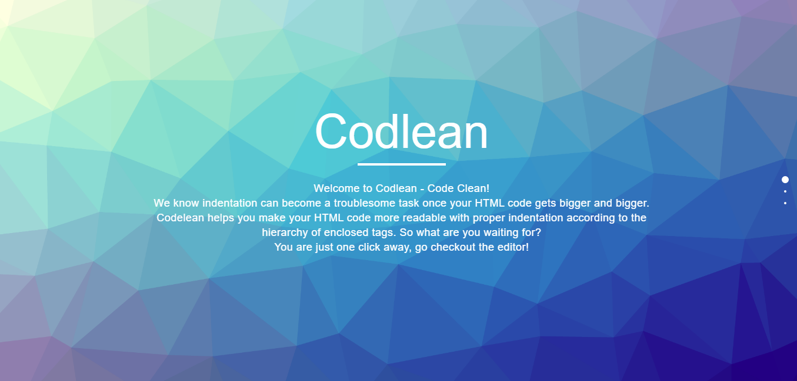
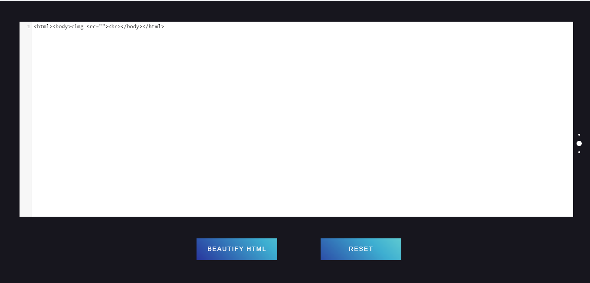
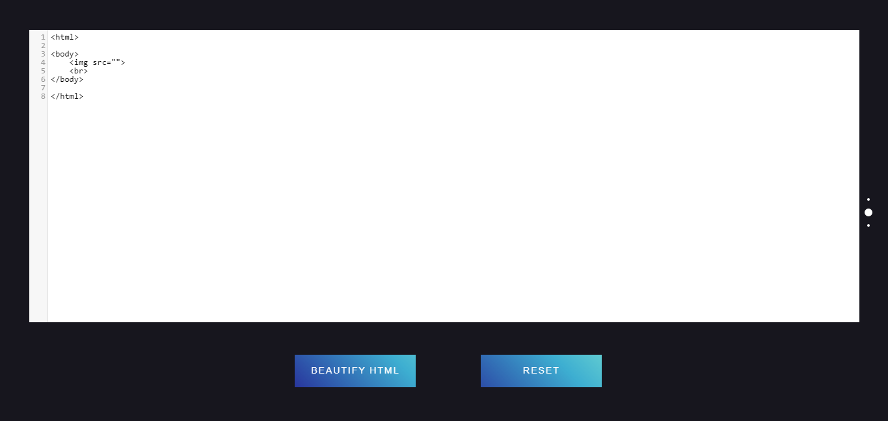

# Codelean
Beautifies the HTML code with correct indentation

Fullpage.js is used for scrolling through the whole div.
-fullpage.js

Code Mirror has been imported in the code with script files
-script1.js
-script2.js
-script3.js
-script4.js

These js files also adjust the code's the indentation as well as form the text editor.

OUTPUT:

